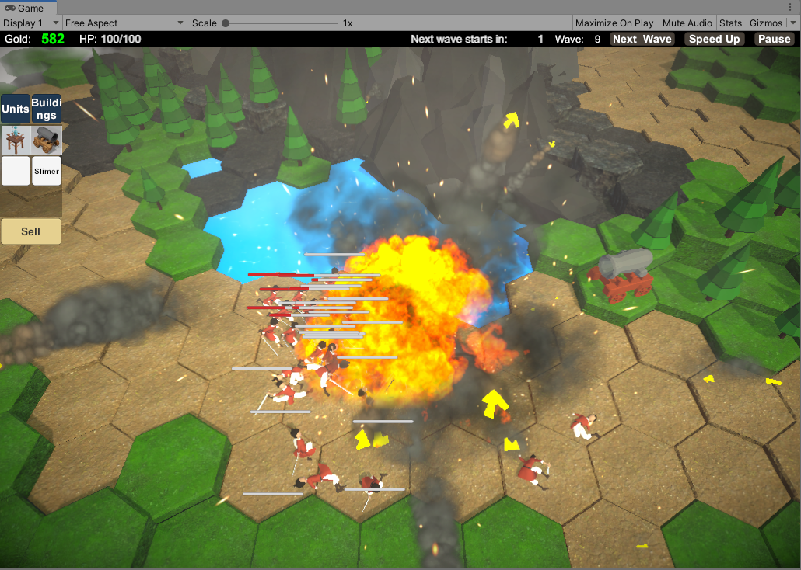
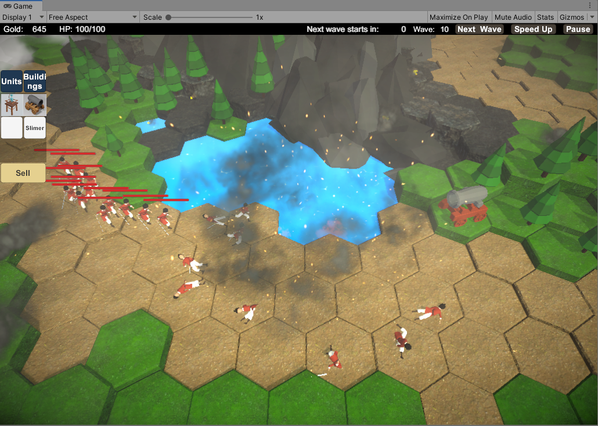
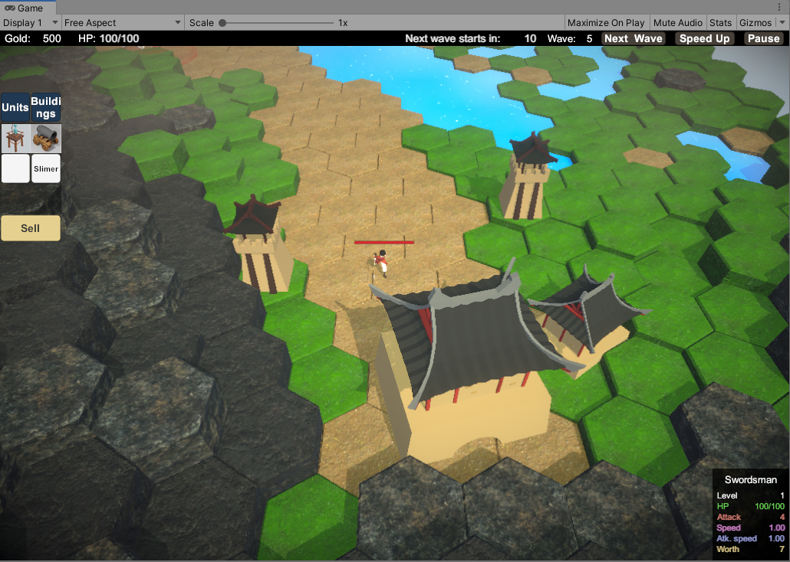
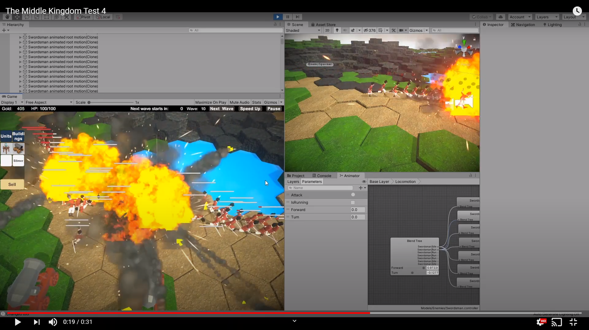
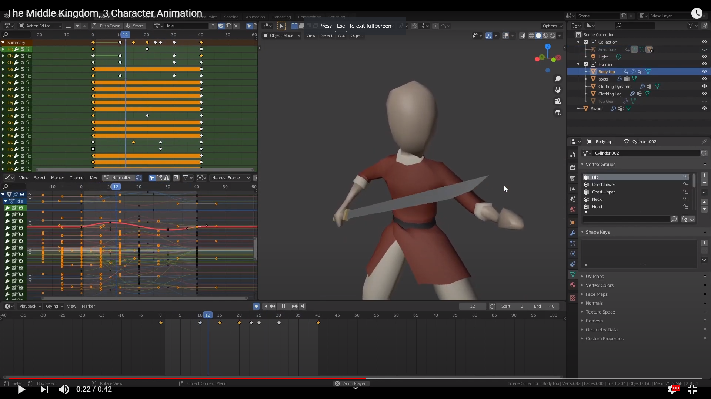

# HexagonTowerDefense
An indie 3D tower defense game created in Unity by a small team of enthusiast. The game is hexagonal tile based and the gameplay might be similar to traditional tower defense game.

The game is still in development.

### Screenshots

---
### Watch test gameplay on YouTube:

### Watch 3D character animation:

### 3D modelling screenshots

### Shaders

